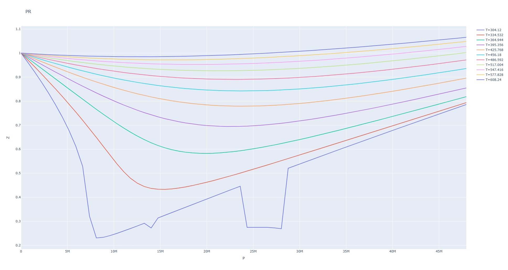

# EoS_data

`EoS_data` 是一个用于计算混合气体状态方程的 Python 类，支持 Peng-Robinson (PR)、Redlich-Kwong (RK) 和 Soave-Redlich-Kwong (SRK) 方程。

## 目录

- [EoS\_data](#eos_data)
  - [目录](#目录)
  - [背景](#背景)
  - [安装](#安装)
  - [使用方法](#使用方法)
    - [类初始化](#类初始化)
    - [计算压缩因子](#计算压缩因子)
    - [绘制压缩因子图](#绘制压缩因子图)
  - [示例](#示例)
  - [测试](#测试)
    - [运行测试](#运行测试)
    - [示例结果](#示例结果)
    - [示例图片](#示例图片)
  - [许可证](#许可证)

## 背景

本项目旨在通过输入混合气体的组成、温度和压力等信息，计算并绘制不同状态方程下的压缩因子 (Z)。支持的状态方程包括 Peng-Robinson (PR)、Redlich-Kwong (RK) 和 Soave-Redlich-Kwong (SRK)。

## 安装

1. 克隆或下载本项目的代码：

```bash
   git clone https://github.com/untuitivist/eos_data.git
   cd eos_data
```

2. 安装所需的 Python 包：
   + 通过 `pip`, `conda` 安装：
   ```
   numpy==1.26.4
   pandas==2.2.2
   plotly==5.19.0
   scipy==1.11.4
   ```

   + 通过`requirements.txt`安装：

   ```bash
      pip install -r requirements.txt
   ```

## 使用方法

### 类初始化

```python
from EoS.EoS import EoS_data

# 初始化 EoS_data 类
y_dict = {'CO_2': 0.8, 'H_2': 0.2}
T_list = [300, 320, 340]
P_list = [1e5, 2e5, 3e5]

eos_data = EoS_data(y_dict=y_dict, T_list=T_list, P_list=P_list, debug=True)
```

### 计算压缩因子

```python
# 计算压缩因子并返回结果 DataFrame
z_df = eos_data.Z_DF(Eq='PR', is_P_r=True, is_T_r=True)
print(z_df)
```

### 绘制压缩因子图

```python
# 绘制压缩因子图
fig = eos_data.Z_figure(Eq='PR', is_P_r=True, is_T_r=True, linemode='lines')
fig.show()
```

## 示例

以下是一个完整的示例，展示了如何使用 `EoS_data` 类来计算和绘制混合气体的压缩因子。

```python
import numpy as np
import pandas as pd
from plotly import graph_objects as go
import warnings
warnings.filterwarnings('ignore', category=RuntimeWarning)

# 导入EoS_data类
from EoS.EoS import EoS_data

# 初始化EoS_data类
y_dict = {'CO_2': 0.8, 'N_2': 0.2}
T_list = [300, 320, 340]
P_list = [1e5, 2e5, 3e5]

eos_data = EoS_data(y_dict=y_dict, T_list=T_list, P_list=P_list, debug=True)

# 计算压缩因子
z_df = eos_data.Z_DF(Eq='PR', is_P_r=True, is_T_r=True)
print(z_df)

# 绘制压缩因子图
fig = eos_data.Z_figure(Eq='PR', is_P_r=True, is_T_r=True, linemode='lines')
fig.show()
```

## 测试

你可以使用 `test.py` 文件来测试 `EoS_data` 类的功能。确保你已经按照[安装](#安装)部分的说明安装了必要的依赖包。

### 运行测试

```bash
python test.py
```

确保 `test.py` 文件位于项目根目录下，并包含正确的测试代码来验证 `EoS_data` 类的功能。

### 示例结果

```bash
验证纯CO_2在P_r: 0.0-6.5, T_r: 1.0-2.0时的PR方程计算结果:
在P_r=6.5时, P应为47931000.0:  True
在T_r=2.0时, T应为608.24:  True
在P_r=1.5, T_r=1.2时, 计算得到的Z应为0.9057152117451431:  True
显示图像, PR方程存在特殊解为正常情况, 示例图片见README
```

### 示例图片



## 许可证

此项目基于 MIT 许可证开源。详情请参阅 LICENSE 文件。

